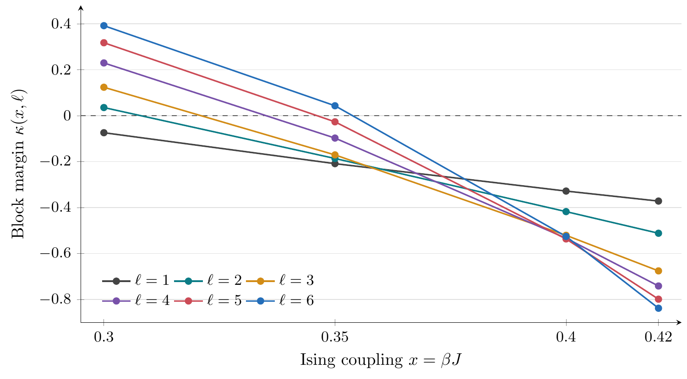

# IsingBlockNumerics

Reproducibility package for the square-lattice Ising block-dynamics example in **Rapid mixing of Gibbs samplers via quantum Dobrushin–Shlosman conditions**, by Cambyse Rouzé and Daniel Stilck França.

The code exhaustively computes finite-block boundary influences for the ferromagnetic Ising model at zero longitudinal field. It provides two certified positive Dobrushin–Shlosman block margins at couplings where the single-site condition fails:

| Coupling `x = βJ` | Square block | Certified margin |
| --- | --- | --- |
| `0.35` | `6 × 6` | `κ > 0.0432` |
| `0.36` | `7 × 7` | `κ > 0.0125` |

These finite-volume certificates supply the classical reference for the manuscript's quantum perturbation result. The single-site margin is `1 − 2 tanh(2x)`, which is negative at both couplings. The block family consists of every translate, each with rate `1/ℓ²`; the paper uses square tori with `L ≥ 2ℓ + 2`.



The figure shows the sampled couplings for sides 1–6. Connecting lines are visual guides; the separate side-7 certificate at `x = 0.36` is included in the data.

## Quick verification

From the repository root, use Python 3.10 or later and a C++17 compiler (GCC or Clang):

```sh
python3 -m venv .venv
. .venv/bin/activate
python3 -m pip install -r requirements.txt
mkdir -p build
c++ -O3 -std=c++17 -ffp-contract=off numerical/ising_blocks/search.cpp -o build/ising-block-search
python3 numerical/ising_blocks/verify.py --search "$PWD/build/ising-block-search"
python3 numerical/ising_blocks/perturbation_window.py
```

The independent verifier directly enumerates the internal and exterior spins for sides 1, 2 and 3 at each of the four tabulated couplings, compares against the stored transfer-matrix results, and checks zero and small coupling. It does not repeat the much larger exhaustive searches at sides 6–8.

The certificate assumes IEEE binary64 arithmetic in round-to-nearest mode and the documented input-weight error bound. **Do not enable `-ffast-math`, arithmetic reassociation, or fused contraction.** The reference data were generated with Apple Clang on Apple silicon; near-ties may select different maximizing boundary configurations on other platforms without changing the certified enclosure.

## Full reproduction and technical details

- [Numerical methods and all reproduction commands](numerical/ising_blocks/README.md): transfer recurrence, exhaustive boundary enumeration, roundoff certificate, CSV conventions, and full searches.
- [Technical note (PDF)](output/pdf/certification_note.pdf), with [LaTeX source](certification_note.tex): finite-block proof, arithmetic bounds and conservative explicit perturbation constants. The note uses the definitions and general theorems of the companion manuscript.
- [Comparison table](numerical/ising_blocks/margin_table.csv) and [coefficient tables](numerical/ising_blocks/): every coefficient includes a maximizing boundary and outward-rounded bounds.
- [Perturbation-window calculation](numerical/ising_blocks/perturbation_window.py) and [stored output](numerical/ising_blocks/perturbation_windows.json): sufficient windows `β|g| ≤ 10⁻⁶⁸` and `10⁻⁷⁶`, respectively. These conservative bounds are not estimates of an optimal threshold.

The numerical work is local to a finite block. It does not simulate quantum dynamics or estimate a critical temperature. Searches grow rapidly with the block side; the side-7 and side-8 runs can take substantially longer than the quick verification. The existing certified tables may be used directly.

To regenerate the comparison plot, install a TeX distribution with PGFPlots and the `standalone` class, plus Poppler's `pdftoppm`, then run:

```sh
python3 numerical/ising_blocks/plot.py
```

To rebuild the technical note:

```sh
mkdir -p output/pdf
pdflatex -interaction=nonstopmode -halt-on-error -output-directory=output/pdf certification_note.tex
pdflatex -interaction=nonstopmode -halt-on-error -output-directory=output/pdf certification_note.tex
```

## Citation

Citation metadata for this package is provided in [CITATION.cff](CITATION.cff). Please cite the archived release when using the code or numerical certificates; the repository describes the evolving source, whereas the archive preserves the version used in the paper.

## Authors

- **Cambyse Rouzé** — Inria, Télécom Paris, LTCI, Institut Polytechnique de Paris, Palaiseau, France.
- **Daniel Stilck França** — Department of Mathematical Sciences, University of Copenhagen, Denmark.

## License

The Python and C++ source code is released under the [MIT License](LICENSE). Data, figures, and documentation are licensed under [CC BY 4.0](LICENSE-DATA.md). Please retain attribution and cite the archived release when using the numerical certificates.
